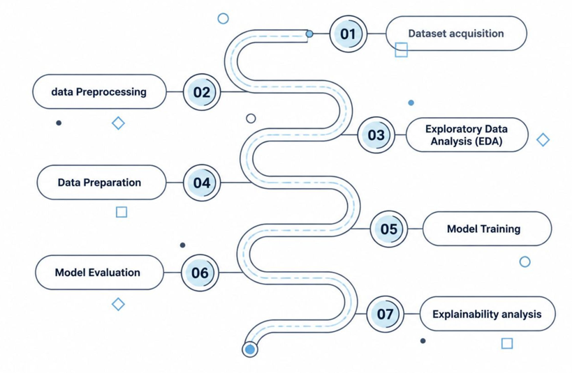
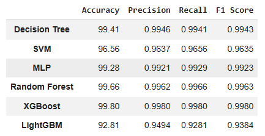
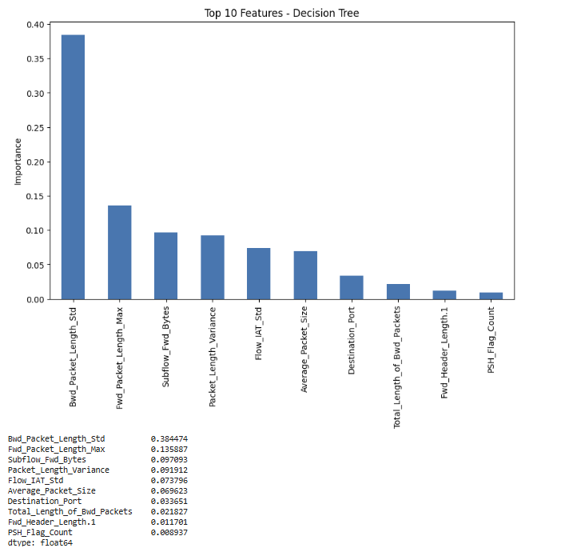
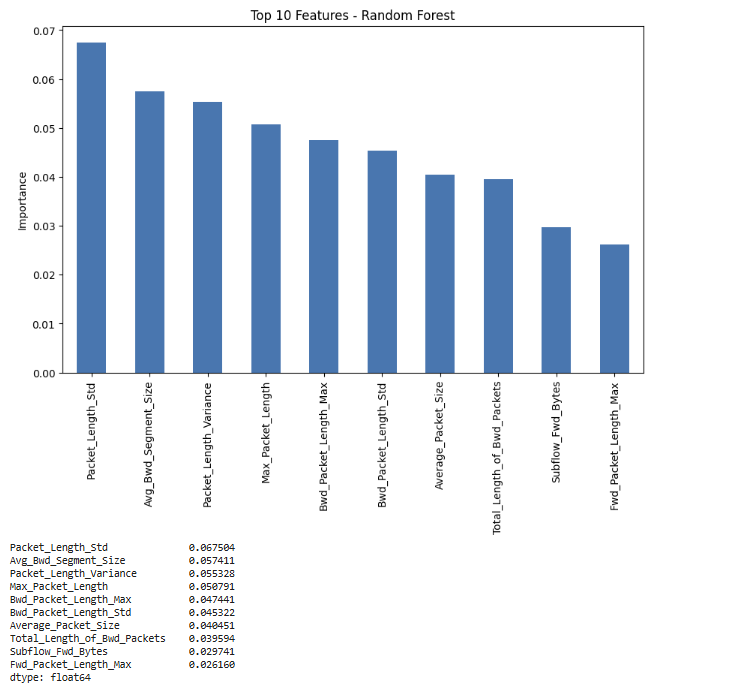
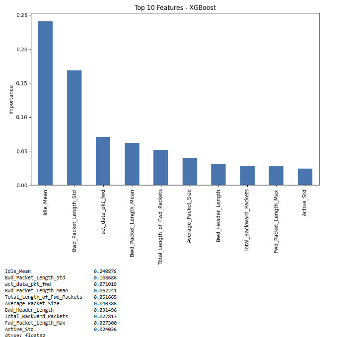
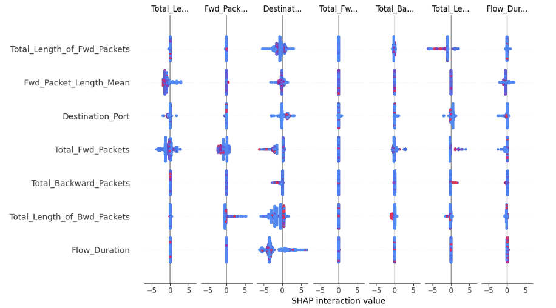
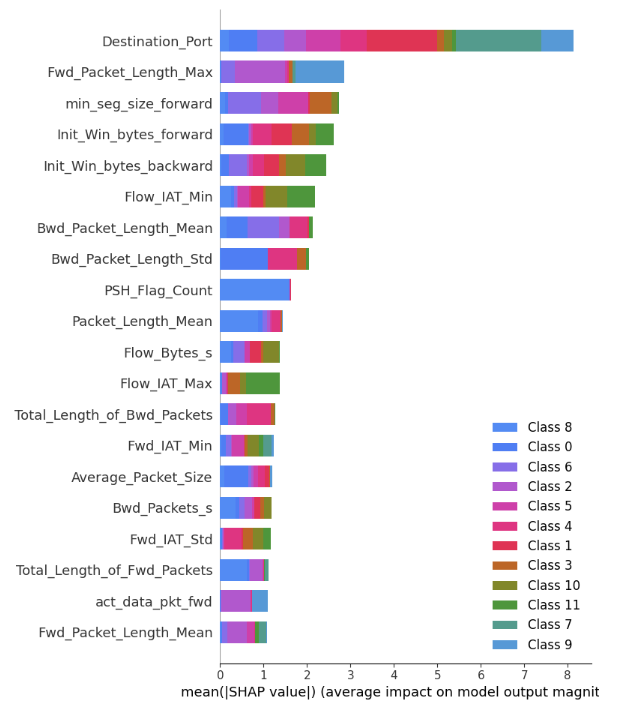

# 🛡️ Network Intrusion Detection System using Machine Learning

A Machine Learning-based **Network Intrusion Detection System (NIDS)** developed using the **CICIDS2017** dataset. This project reproduces and extends a published research paper by implementing additional ensemble learning models, comprehensive model evaluation, and explainable AI techniques for network intrusion detection.


---

## 📖 Project Overview

Network Intrusion Detection Systems (NIDS) are essential for identifying malicious activities within computer networks. Traditional signature-based systems often struggle to detect evolving cyber threats.

This project reproduces the methodology presented in an existing research paper and extends it by:

- Implementing additional ensemble learning models
- Comparing six machine learning algorithms
- Performing comprehensive exploratory data analysis (EDA)
- Applying Feature Importance analysis
- Explaining predictions using SHAP (SHapley Additive exPlanations)

---

## 🏆 Highlights

- ✅ Best Accuracy: **99.80% (XGBoost)**
- ✅ Evaluated **6 Machine Learning Models**
- ✅ Added **Feature Importance** and **SHAP Explainability**
- ✅ Extended the original research paper using Python

---


## 🚀 Features

- Data Preprocessing
- Exploratory Data Analysis (EDA)
- Decision Tree
- Support Vector Machine (SVM)
- Multi-Layer Perceptron (MLP)
- Random Forest
- XGBoost
- LightGBM
- Model Performance Comparison
- Feature Importance Analysis
- SHAP Explainability
- Confusion Matrix

---

## 📂 Dataset

**Dataset:** CICIDS2017

Developed by the **Canadian Institute for Cybersecurity (CIC)**

### Dataset Statistics

- Approximately **2.5 Million** Network Flows
- **78** Network Traffic Features
- **12** Traffic Classes

Dataset Download:

https://www.unb.ca/cic/datasets/ids-2017.html

> **Note:** The dataset is not included in this repository because of its large size.

---

## ⚙️ Methodology

The project follows the workflow below:

```text
CICIDS2017 Dataset
        │
        ▼
Data Preprocessing
        │
        ▼
Exploratory Data Analysis
        │
        ▼
Data Preparation
        │
        ▼
Model Training
        │
        ▼
Performance Evaluation
        │
        ▼
Feature Importance
        │
        ▼
SHAP Explainability
```

---

## 🤖 Machine Learning Models

### Baseline Models (Research Paper)

- Decision Tree
- Support Vector Machine (SVM)
- Multi-Layer Perceptron (MLP)

### Additional Models (This Project)

- Random Forest
- XGBoost
- LightGBM

---

## 📊 Performance Comparison

| Model | Accuracy |
|--------|----------|
| **XGBoost** | **99.80%** |
| Random Forest | 99.66% |
| Decision Tree | 99.41% |
| MLP | 99.28% |
| SVM | 96.56% |
| LightGBM | 92.81% |

**Best Performing Model:** XGBoost (99.80%)

---

## 🔍 Explainable AI

To improve model interpretability, the project includes:

- Feature Importance Analysis
- SHAP Summary Plot
- SHAP Bar Plot
- SHAP Force Plot

These techniques help explain why the model predicts a network flow as benign or malicious.

---

## 📸 Project Screenshots

### Methodology



### Results



### Feature Importance

#### Top Features








### SHAP Explainability

#### SHAP Summary Plot



#### SHAP Bar Plot



#### SHAP Force Plot


---

## 📈 Improvements over the Research Paper

| Research Paper | This Project |
|----------------|-------------|
| MATLAB + KNIME | Python |
| Decision Tree, SVM, MLP | Added Random Forest, XGBoost & LightGBM |
| Standard Evaluation | Comprehensive Evaluation |
| No Explainability | Feature Importance + SHAP |
| Limited EDA | Detailed Exploratory Data Analysis |
| Three Models | Six Machine Learning Models |

---

## 🛠️ Technologies Used

- Python
- Google Colab
- Pandas
- NumPy
- Matplotlib
- Scikit-learn
- XGBoost
- LightGBM
- SHAP
- Joblib

---

## 📁 Repository Structure

```text
Network-Intrusion-Detection-System/
│
├── README.md
├── requirements.txt
├── NIDS_Project.ipynb
├── NIDS_Presentation.pptx
├── data/
│   └── dataset.md
├── images/
│   ├── methodology.png
│   ├── results.png
│   ├── feature_importance.png
│   ├── shap_summary.png
│   └── shap_force.png
└── .gitignore
```

---

## ▶️ Getting Started

Clone the repository:

```bash
git clone https://github.com/JoshikaMedisetty/Network-Intrusion-Detection-System.git
```

Install the required packages:

```bash
pip install -r requirements.txt
```

Open the notebook:

```
NIDS_Project.ipynb
```

Update the dataset path if required and run all notebook cells.

---

## 🔮 Future Work

- Real-time network intrusion detection
- Hyperparameter optimization
- Deep learning models (LSTM, Transformer)
- Web-based deployment using Flask or FastAPI
- Integration with Security Information and Event Management (SIEM) platforms

---

## 📚 References

- CICIDS2017 Dataset
- Scikit-learn Documentation
- XGBoost Documentation
- LightGBM Documentation
- SHAP Documentation
- Original Research Paper(referenced in this project)

---

## 👩‍💻 Author

**Joshika Medisetty**

B.Tech Computer Science and Engineering

GitHub: https://github.com/JoshikaMedisetty

LinkedIn: https://www.linkedin.com/in/joshika-medisetty/

---